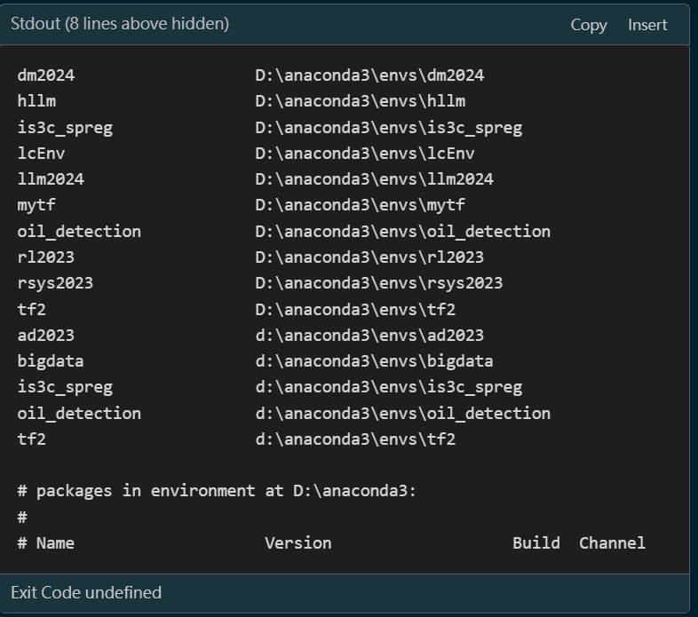

# VS Code 和 Anaconda 設定檔 | VS Code and Anaconda Settings | VS Code と Anaconda 設定

[中文](README.md) | [English](README_EN.md) | [日本語](README_JP.md)

這個倉庫包含 VS Code/Windsurf 和 Anaconda 環境設定，專門設計用於在不同電腦間同步設定。特別優化支援 Windsurf（基於 VS Code 的 AI 輔助開發環境）。

## 特別說明
- 本設定專為 Windsurf IDE 優化，確保與 Codeium AI 助手完全相容
- 同時支援標準 VS Code，但某些 AI 相關功能可能僅在 Windsurf 中可用
- 包含 GPU 加速相關設定，優化 AI 開發體驗

<!-- CASCADE-SETTINGS-SYNC-MARKER -->
<!-- 版本: 1.0 -->
<!-- 上次更新: 2024-12-23 -->
<!-- 設定類型: VS Code, Windsurf, Anaconda, GPU -->

## 快速預覽



## 自動同步步驟
如果您使用 VS Code 和 Codeium 擴展：
1. 打開這個 README.md 文件
2. 告訴 Codeium "請幫我同步這個專案的設定"
3. Codeium 會自動檢測設定標記並完成所有設定

如果您想手動設定，請按照下面的步驟操作。

## 目錄結構
```
vscode-settings-sync/
├── .vscode/                 # VS Code 設定
│   ├── settings.json       # 基本設定
│   └── keybindings.json    # 鍵盤快捷鍵
├── conda_env/              # Anaconda 環境設定
│   └── aia_env.yml        # AIA_ENV 環境配置
└── images/                 # 文檔圖片
    ├── vscode-preview.png
    └── anaconda-preview.png
```

## 初始設定流程

### 主要電腦（首次設定）
1. 創建並設定 VS Code 環境：
   - 安裝 VS Code
   - 安裝所需擴展（如：Python, Vim 等）
   - 配置 settings.json 和 keybindings.json

2. 設定 Anaconda 環境：
   - 安裝 Anaconda
   - 創建新環境：`conda create -n AIA_ENV python=3.10`
   - 安裝所需套件：`conda install pytorch torchvision torchaudio -c pytorch`

3. 導出環境設定：
   ```bash
   # 導出 Anaconda 環境
   conda activate AIA_ENV
   conda env export --no-builds > conda_env/aia_env.yml
   ```

4. 上傳到 Git：
   ```bash
   git init
   git add .
   git commit -m "Initial commit: VS Code and Anaconda settings"
   git remote add origin <您的GitHub倉庫URL>
   git push -u origin main
   ```

### 其他電腦（同步設定）
1. 克隆設定倉庫：
   ```bash
   git clone <您的GitHub倉庫URL>
   ```

2. 設定 VS Code：
   - 安裝 VS Code 和必要擴展
   - 將 `.vscode` 資料夾複製到您的專案目錄中
   - 修改 `settings.json` 中的路徑（如果 Anaconda 安裝路徑不同）

3. 設定 Anaconda 環境：
   ```bash
   # 創建環境
   conda env create -f conda_env/aia_env.yml
   ```

## 更新設定流程

### 當您更改了設定
1. 更新 VS Code 設定：
   - 如果修改了 VS Code 設定，更新 `.vscode` 資料夾中的文件

2. 更新 Anaconda 環境：
   ```bash
   # 如果安裝了新的套件，更新環境文件
   conda activate AIA_ENV
   conda env export --no-builds > conda_env/aia_env.yml
   ```

3. 提交更改：
   ```bash
   git add .
   git commit -m "更新設定: <描述更改內容>"
   git push
   ```

### 在其他電腦上同步更改
1. 拉取最新更改：
   ```bash
   git pull
   ```

2. 更新 VS Code 設定：
   - 複製更新後的 `.vscode` 資料夾到專案目錄

3. 更新 Anaconda 環境：
   ```bash
   # 更新環境
   conda activate AIA_ENV
   conda env update -f conda_env/aia_env.yml
   ```

## 常見問題處理
1. VS Code 設定不生效：
   - 確認 `.vscode` 資料夾在正確的專案目錄中
   - 重新啟動 VS Code

2. Anaconda 環境問題：
   - 如果環境損壞，可以重新創建：
     ```bash
     conda deactivate
     conda env remove -n AIA_ENV
     conda env create -f conda_env/aia_env.yml
     ```

3. 路徑問題：
   - 確認 `settings.json` 中的 Anaconda 路徑符合當前電腦的安裝路徑
   - 根據需要調整路徑設定
