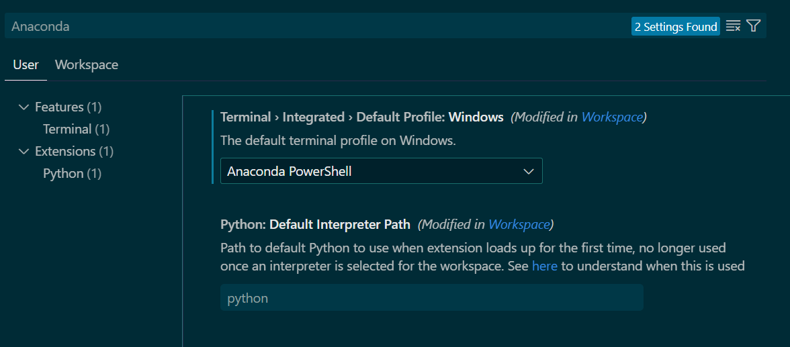

# VS Code and Anaconda Settings

[中文](README.md) | [English](README_EN.md)

This repository contains my VS Code and Anaconda environment settings for synchronization across different computers.

<!-- CASCADE-SETTINGS-SYNC-MARKER -->
<!-- Version: 1.0 -->
<!-- Last Updated: 2024-12-23 -->
<!-- Settings Type: VS Code, Anaconda, GPU -->

## Quick Preview



## Automatic Sync Instructions
If you use VS Code with the Codeium extension, simply:
1. Open this README.md file
2. Tell Codeium: "Please help me sync this project's settings"
3. Codeium will automatically detect the settings marker and help you complete all settings

If you prefer manual setup, follow the steps below.

## Directory Structure
```
vscode-settings-sync/
├── .vscode/                 # VS Code settings
│   ├── settings.json       # Basic settings
│   └── keybindings.json    # Keyboard shortcuts
├── conda_env/              # Anaconda environment settings
│   └── aia_env.yml        # AIA_ENV environment configuration
└── images/                 # Documentation images
    ├── vscode-preview.png
    └── anaconda-preview.png
```

## Initial Setup Process

### Primary Computer (First Time Setup)
1. Create and configure VS Code environment:
   - Install VS Code
   - Install required extensions (e.g., Python, Vim)
   - Configure settings.json and keybindings.json

2. Set up Anaconda environment:
   - Install Anaconda
   - Create new environment: `conda create -n AIA_ENV python=3.10`
   - Install required packages: `conda install pytorch torchvision torchaudio -c pytorch`

3. Export environment settings:
   ```bash
   # Export Anaconda environment
   conda activate AIA_ENV
   conda env export --no-builds > conda_env/aia_env.yml
   ```

4. Upload to Git:
   ```bash
   git init
   git add .
   git commit -m "Initial commit: VS Code and Anaconda settings"
   git remote add origin <Your GitHub Repository URL>
   git push -u origin main
   ```

### Other Computers (Sync Setup)
1. Clone settings repository:
   ```bash
   git clone <Your GitHub Repository URL>
   ```

2. Set up VS Code:
   - Install VS Code and necessary extensions
   - Copy the `.vscode` folder to your project directory
   - Modify paths in `settings.json` (if Anaconda installation path differs)

3. Set up Anaconda environment:
   ```bash
   # Create environment
   conda env create -f conda_env/aia_env.yml
   ```

## Update Process

### When You Change Settings
1. Update VS Code settings:
   - If you modified VS Code settings, update files in the `.vscode` folder

2. Update Anaconda environment:
   ```bash
   # If you installed new packages, update the environment file
   conda activate AIA_ENV
   conda env export --no-builds > conda_env/aia_env.yml
   ```

3. Commit changes:
   ```bash
   git add .
   git commit -m "Update settings: <describe changes>"
   git push
   ```

### Syncing Changes on Other Computers
1. Pull latest changes:
   ```bash
   git pull
   ```

2. Update VS Code settings:
   - Copy the updated `.vscode` folder to your project directory

3. Update Anaconda environment:
   ```bash
   # Update environment
   conda activate AIA_ENV
   conda env update -f conda_env/aia_env.yml
   ```

## Troubleshooting
1. VS Code settings not taking effect:
   - Verify `.vscode` folder is in the correct project directory
   - Restart VS Code

2. Anaconda environment issues:
   - If environment is corrupted, recreate it:
     ```bash
     conda deactivate
     conda env remove -n AIA_ENV
     conda env create -f conda_env/aia_env.yml
     ```

3. Path issues:
   - Verify Anaconda paths in `settings.json` match your computer's installation path
   - Adjust paths as needed
